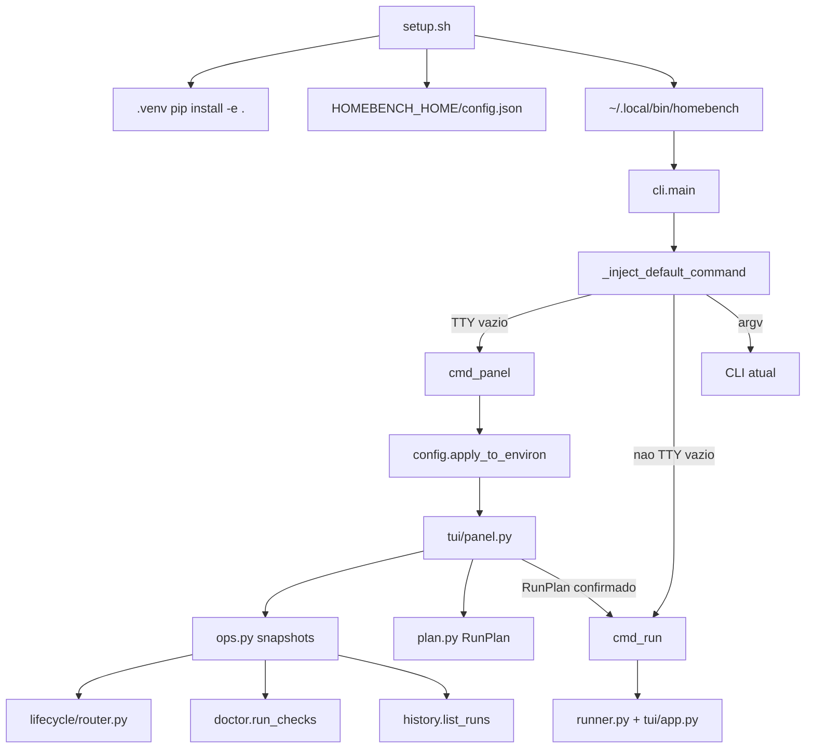

# Guided Ops Design

**Spec**: `.specs/features/guided-ops/spec.md`
**Status**: Draft (aguarda confirmação do operador)

---

## Architecture Overview

Três camadas. O shell só instala. O Python headless decide. A TUI só pinta e devolve um
`RunPlan`. O leaderboard existente não é reescrito.

**Abordagens consideradas (mesmo escopo):**

| | Abordagem | Prós | Contras |
| --- | --- | --- | --- |
| **A (escolhida)** | App Textual multi-screen + módulos headless | Cabe no `textual` já dependido; faixa sempre visível; testável com `run_test` como `tests/test_tui.py` | Confirmação de unload tem de viver no painel, não depois, senão GOPS-17 quebra |
| B | Wizard sequencial (7 telas) | Igual ao doc de contexto antigo | Operador recusou; não dá para ir a Doctor sem passar por Planejar |
| C | Loop `rich.prompt` sem Textual | Menos widgets | Não entrega BIOS + faixa permanente; mistura I/O no “negócio” |

Escolha: **A**. Confirmada no context.md.



**Direção de dependência (AD-005):** `config.py`, `plan.py` e `ops.py` não importam `tui/`,
`rich` nem Textual. `tui/panel.py` importa os três. `lifecycle/` não muda de dono.

**AD-001:** `setup.sh` e o painel não invocam Docker, `sudo` nem `systemctl`. Load/unload
continua HTTP, via `_prepare_router_models` já existente.

---

## Code Reuse Analysis

### Existing Components to Leverage

| Component | Location | How to Use |
| --- | --- | --- |
| `LlamaRouterClient.props` / `list_models` | `src/homebench/lifecycle/router.py` | Snapshot da faixa (GOPS-09/10) |
| `doctor.run_checks` / `Check` | `src/homebench/doctor.py` | Tela Doctor (GOPS-19) |
| `history.list_runs` / `RunRecord` | `src/homebench/history.py` | Tela Histórico (GOPS-20) |
| `default_home` | `src/homebench/history.py` | Mesma raiz de `config.json` |
| `_prepare_router_models` + `_make_confirmer` | `src/homebench/cli.py` | AD-002 no Rodar; painel injeta confirmer |
| `cmd_run` / `HomebenchApp` | `src/homebench/cli.py`, `tui/app.py` | Handoff GOPS-18; `--force-unload` só depois da confirmação no painel |
| `_inject_default_command` / `_COMMANDS` | `src/homebench/cli.py` | GOPS-06/07/08; incluir `panel` no set |
| `HomebenchApp.run_test` | `tests/test_tui.py` | Padrão de teste do painel |
| Isolamento de `$HOMEBENCH_HOME` | `tests/conftest.py` | Setup e `last_plan` não tocam o home real |

### Integration Points

| System | Integration Method |
| --- | --- |
| llama.cpp router | HTTP já existente; painel só lê `/props` e `/v1/models` até o Rodar |
| Config / env | `config.apply_to_environ` no início de `main` e no `setup.sh` (grava arquivo; não exporta a chave para o disco) |
| Leaderboard | `cmd_panel` encerra o App do painel e chama `cmd_run` com `Namespace` derivado do `RunPlan` |

---

## Components

### `setup.sh`

- **Purpose**: Instalar só o homebench e gravar config.
- **Location**: `setup.sh` (raiz do repo)
- **Interfaces**:
  - `./setup.sh` — prompts no TTY, defaults no Enter
  - `./setup.sh --defaults` — sem prompts
- **Dependencies**: `python3` ≥ 3.9 no PATH; rede só para `pip` se o índice for remoto
- **Reuses**: nenhum módulo Python até o venv existir; depois pode chamar `.venv/bin/homebench doctor`
- **Regras**: `cd` para o diretório do script; sem `docker`/`sudo`/`systemctl` em qualquer ramo; `HOMEBENCH_HOME` respeitado se já exportado

### `HomebenchConfig`

- **Purpose**: Persistir host, caminho da chave, diretório de modelos e `last_plan`.
- **Location**: `src/homebench/config.py`
- **Interfaces**:
  - `load(home: Optional[str] = None) -> HomebenchConfig` — arquivo ausente ou JSON inválido ⇒ defaults vazios / None, sem exceção
  - `save(cfg: HomebenchConfig, home: Optional[str] = None) -> str` — nunca escreve o valor da chave
  - `apply_to_environ(cfg: HomebenchConfig) -> None` — preenche `LLAMACPP_HOST`, `LLAMACPP_API_KEY` (lido do arquivo), `HOMEBENCH_MODEL_DIR` **somente se a env correspondente estiver vazia**
  - `read_api_key(path: str) -> Optional[str]` — conteúdo stripado; arquivo ausente ⇒ None; nunca loga o valor
- **Dependencies**: stdlib; `history.default_home`
- **Reuses**: convenção `$HOMEBENCH_HOME`

### `RunPlan`

- **Purpose**: Plano de run validável sem I/O de TUI.
- **Location**: `src/homebench/plan.py`
- **Interfaces**:
  - `DEPTH_CHOICES = (0, 8192, 32768)`
  - `RunPlan(model_ids, depths, run_speed, run_quality)`
  - `problems() -> List[str]` — vazio ⇒ plano válido para Rodar; senão mensagens de GOPS-13
  - `from_dict` / `to_dict` para `last_plan`
  - `restore(saved, available_ids) -> RunPlan` — descarta ids sumidos; depths fora de `DEPTH_CHOICES` caem fora
- **Dependencies**: nenhum
- **Reuses**: nenhum

### Snapshots headless

- **Purpose**: Dados da faixa, Doctor e Histórico sem Textual.
- **Location**: `src/homebench/ops.py`
- **Interfaces**:
  - `router_status(client: Optional[LlamaRouterClient] = None) -> RouterStatus` — inalcançável ⇒ `reachable=False`, `error` sem chave
  - `doctor_snapshot() -> List[Check]` — delega `doctor.run_checks`
  - `history_snapshot(home=None) -> List[RunRecord]` — delega `list_runs` (já mais novo primeiro)
- **Dependencies**: `lifecycle.router`, `doctor`, `history`
- **Reuses**: clientes e tipos já testados

### Painel BIOS

- **Purpose**: Renderizar telas e devolver um `RunPlan` confirmado, ou nada.
- **Location**: `src/homebench/tui/panel.py`
- **Interfaces**:
  - `run_panel() -> Optional[RunPlan]` — `None` = operador saiu
  - Telas: menu, Planejar, Doctor, Histórico; faixa visível nas três últimas
  - Rodar: se `problems()` não vazio, notifica e fica; se há residentes fora do plano, modal sim/não; não ⇒ fica; sim ⇒ `app.exit` com o plano
- **Dependencies**: `ops`, `plan`, `config` (gravar `last_plan` ao sair de Planejar com plano válido)
- **Reuses**: padrão `App` / `run_test` de `tui/app.py`; **não** importa `HomebenchApp` para medir

### CLI: `panel` e default argv

- **Purpose**: Entrada GOPS-06/07/08 e handoff GOPS-18.
- **Location**: `src/homebench/cli.py` (modify)
- **Interfaces**:
  - `_inject_default_command(argv, *, stdin_is_tty=None, stdout_is_tty=None)` — `None` consulta `isatty()`; TTY+vazio ⇒ `["panel"]`; senão vazio ⇒ `["run"]`
  - subparser `panel`; `_COMMANDS` inclui `"panel"`
  - `cmd_panel`: `apply_to_environ(load())`; `plan = run_panel()`; se `plan` então monta `Namespace` e chama `cmd_run` com `force_unload=True` (confirmação já feita no painel)
  - `main` chama `apply_to_environ` cedo, para `doctor`/`models` também lerem o config
- **Dependencies**: config, panel, cmd_run
- **Reuses**: `_select_models`, `_prepare_router_models` via `cmd_run`

---

## Data Models

### HomebenchConfig

```python
@dataclass
class HomebenchConfig:
    host: str = "http://127.0.0.1:8080"
    api_key_file: str = ""          # path only
    model_dir: str = ""
    last_plan: Optional[dict] = None
```

JSON em `$HOMEBENCH_HOME/config.json`. Sem campo `api_key`.

**Relationships**: `last_plan` é o `to_dict()` de `RunPlan`.

### RunPlan

```python
@dataclass
class RunPlan:
    model_ids: List[str]
    depths: List[int]          # subset of DEPTH_CHOICES, sorted unique
    run_speed: bool = True
    run_quality: bool = False  # fork foca performance; painel default = só velocidade
```

Default `run_quality=False` alinha `--no-quality` desta fork. O operador pode marcar “os dois”
ou “só qualidade” no Planejar.

### RouterStatus

```python
@dataclass
class RouterStatus:
    host: str
    reachable: bool
    build_info: Optional[str] = None
    resident_ids: List[str] = None  # factory list
    error: Optional[str] = None     # never contains the key value
```

**Relationships**: faixa lê isto; Doctor lê `Check`, não isto (Doctor é o conjunto completo de
`run_checks`).

---

## Error Handling Strategy

| Cenário | Tratamento | Impacto para o usuário |
| --- | --- | --- |
| Python &lt; 3.9 no setup | exit ≠ 0 antes do venv | GOPS-01 |
| `pip` falha | exit ≠ 0; não finge que instalou | Operador vê o erro do pip |
| `~/.local/bin` indisponível | aviso + caminho `.venv/bin/homebench`; exit 0 | GOPS-03 |
| Router down no setup | venv+config ficam; doctor `fail` | GOPS-04 |
| `config.json` podre | `load()` ignora; env/defaults | Edge case |
| Arquivo da chave ausente | `API_KEY` não setada; faixa/doctor falham auth | GOPS-10 |
| Router down no painel | faixa `down`; telas seguem | GOPS-10 |
| Plano inválido no Rodar | notify; permanece | GOPS-13 |
| Recusa AD-002 | permanece; nenhum unload | GOPS-17 |
| `panel` sem TTY | exit ≠ 0 + mensagem | GOPS-08 |
| `cmd_run` depois do painel falha | mesmo código de saída que a CLI | Sem segunda TUI de planejamento |

---

## Risks & Concerns

| Concern | Location (file:line) | Impact | Mitigation |
| --- | --- | --- | --- |
| `_inject_default_command([]) == ["run"]` quebra se pytest rodar em TTY | `src/homebench/cli.py:200` · `tests/test_cli.py:4` | GOPS-07 falso-positivo / regressão da CLI | Parâmetros `stdin_is_tty`/`stdout_is_tty`; testes existentes passam `False` explícito; default ainda consulta `isatty()` |
| `_COMMANDS` desacoplado dos subparsers | `src/homebench/cli.py:196` | `homebench panel` vira `run panel` | Incluir `"panel"` no set; estender o teste parametrizado de `test_cli_models_command.py` se já cobre nomes |
| App Textual aninhado (painel + leaderboard) | `tui/app.py` | Hang ou teclado morto | Painel **encerra** antes de `cmd_run`; nunca `push_screen` no leaderboard |
| Confirmação AD-002 depois do painel fechar | `cli.py:_make_confirmer` | GOPS-17: recusa cairia no shell, não no painel | Confirmer Textual **dentro** do painel; `cmd_run(..., force_unload=True)` só após sim |
| `setup.sh` gravar no `~/.homebench` real | novo `setup.sh` | Sujeira no home do operador durante pytest | Testes exportam `HOME` + `HOMEBENCH_HOME` para tmp; script respeita `HOMEBENCH_HOME` |
| Valor da chave ir para JSON ou widget | `config.py` / `ops.py` | Vazamento (AGENTS.md) | Teste: chave conhecida não aparece em `save()` JSON nem em `RouterStatus.error` nem no texto do painel |
| `apply_to_environ` muta `os.environ` | `config.py` | Testes e CLI posteriores herdam chave | `monkeypatch` nos testes; `apply` só preenche env vazia |
| `cli.py` já grande | `cli.py` ~876 linhas | Extração incompleta duplica AD-002 | Não copiar `_prepare_router_models`; só `Namespace` + `cmd_run` |
| Lista de um item só passar teste de modelos | lição L-001 (candidate) | Restaurar/marcar só o primeiro | Testes de `RunPlan` e Histórico com **dois** ids / dois runs |

---

## Tech Decisions

| Decision | Choice | Rationale |
| --- | --- | --- |
| TD-01 | `config.json` em `$HOMEBENCH_HOME`; env ganha | Um arquivo, mesma raiz de runs/cache; override pontual sem editar |
| TD-02 | Chave só como `api_key_file` | Nunca persistir segredo; `apply_to_environ` lê na hora |
| TD-03 | Default do plano = só velocidade | Alinha o foco desta fork (`--no-quality`) |
| TD-04 | Painel devolve `RunPlan`; `cmd_run` executa | Leaderboard e lifecycle ficam no caminho já testado |
| TD-05 | Confirmação AD-002 no painel; depois `--force-unload` | Satisfaz GOPS-17 (ficar no painel se recusar) sem aninhar Apps |
| TD-06 | `_inject_default_command` inspeciona TTY com override injetável | pytest não-TTY preserva `[] → run`; TTY real abre painel |
| TD-07 | `setup.sh` na raiz, não `homebench setup` | Pedido do operador |
| TD-08 | Profundidades = toggles dos três defaults | Context.md; campo livre fica Deferred |

> **Nível de projeto:** TD-01/TD-02 (config persistida, env ganha, chave só como path) e TD-06
> (argv vazio + TTY → painel) viram AD-008 e AD-009. Features seguintes precisam saber disso.

**Conformidade com ADs ativas:** AD-001 (HTTP only, setup sem Docker) — conforma. AD-002/007
(confirmar residentes fora do plano) — conforma via modal do painel + `force_unload` depois.
AD-003 (precedência de load params) — intocado. AD-004 (detecção por host) — intocado.
AD-005 (headless) — `config`/`plan`/`ops` sem TUI. AD-006 — GPU/throughput continuam adiados.
