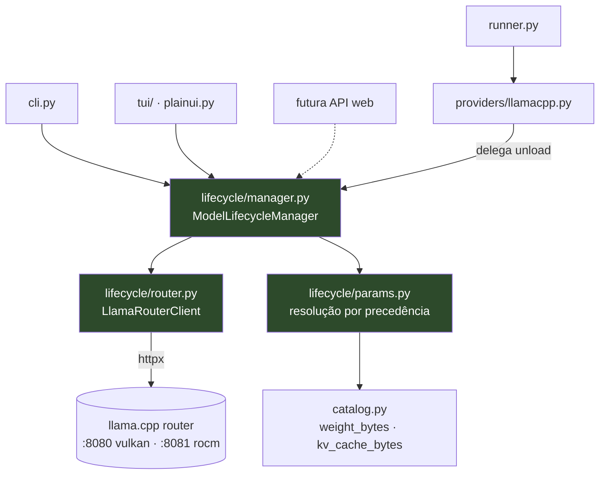

# Model Lifecycle Design

**Spec**: `.specs/features/model-lifecycle/spec.md`
**Status**: Approved (usuário aprovou em 2026-08-28)

---

## Architecture Overview

Módulo `lifecycle/` **headless e independente**: não importa nada de `tui/`, `rich`, nem da
hierarquia `Provider`. O provider *usa* o módulo; a futura API web usará o mesmo módulo
diretamente. Essa direção de dependência é o que cumpre a restrição do doc de contexto ("a lógica
de negócio não pode ficar acoplada à TUI").

O `homebench` descobre sozinho que está falando com um router via `GET /props` (`role == "router"`),
por host. Contra um `llama-server` clássico, o recurso simplesmente não é oferecido — sem quebrar.



**Regra de dependência:** `lifecycle/` não importa `providers/`, `tui/`, `runner.py` nem `rich`.
A seta `PROV → MGR` é unidirecional. Isso é testável e deve virar teste (ver TD-05).

---

## Research — contrato verificado ao vivo

Cadeia de verificação: código → docs do projeto → bundle do painel web → **teste ao vivo**.
Nada aqui é suposição.

```
GET  /props          → {"role":"router","max_instances":2,"models_autoload":false,
                        "build_info":"b10615-f280b2698"}
GET  /v1/models      → data[].id
                       data[].status.value ∈ {loaded, loading, unloaded}
                       data[].status.args  → argv resolvido (presente MESMO quando unloaded)
                       data[].status.preset, data[].source
POST /models/load    {"model": id, "extra_args": [...]}  → {"success": true}
POST /models/unload  {"model": id}                       → {"success": true}
GET  /models/sse     → stream de eventos de status
```

**Autenticação:** todos os endpoints, incluindo `/props`, retornam
`401 {"error":{"type":"authentication_error","message":"Invalid API Key"}}` sem a chave.

**Medição:** `qwen35-4b` (2,8 GB) → `loaded` em 4 s.

**Builds divergentes entre hosts:** vulkan `b10615-f280b2698`, rocm `b10664-e70802a01`.
Consequência de design: capacidade é detectada **por host**, nunca em cache global.

**O que eu não sei:** o que `GET /props` devolve num `llama-server` clássico (não-router) —
não tenho um para testar. Por isso o teste é *positivo* (`role == "router"`), nunca negativo:
ausência do campo, 404 ou erro de parse ⇒ "não é router". Essa forma é segura sem conhecer o
formato do não-router.

---

## Code Reuse Analysis

### Componentes existentes a aproveitar

| Componente | Localização | Como usar |
| --- | --- | --- |
| `OpenAICompatibleProvider.__init__` | `providers/openai_compat.py:44-48` | Já resolve `api_key` via `api_key_env`; `llamacpp.py:17` já declara `LLAMACPP_API_KEY`. **Autenticação não precisa de código novo.** |
| `normalize_host()` | `providers/openai_compat.py:26` | Normalização de host do `LlamaRouterClient` — não reimplementar |
| `ProviderError` | `providers/base.py:17` | Tipo de erro único do repo; `lifecycle/` levanta o mesmo |
| `weight_bytes()`, `kv_cache_bytes()`, `QUANT_GB_PER_B` | `catalog.py:112-127` | Base da heurística de `-ngl` (MLC-13) |
| `HardwareInfo.memory_budget()` | `hardware.py:49-60` | Orçamento de memória para a heurística |
| `Check` + `run_checks()` | `doctor.py:17,42` | Checagens de router (MLC-12) seguem o mesmo dataclass |
| `_pick()` | `models.py:14-17` | `from_dict` já ignora chaves desconhecidas ⇒ campos novos são retrocompatíveis |
| Padrão `_FakeStream` / `pytest-httpx` | `tests/test_providers.py:74` | Testes do router sem servidor vivo |

### Pontos de integração

| Sistema | Método de integração |
| --- | --- |
| `runner.py:152` `_run_model` | `cfg.unload_between` **já chama** `provider.unload()` — passa a funcionar sem tocar no runner |
| `runner.py:72-87` `RunConfig.to_dict()` | ⚠️ allowlist manual: campo novo **precisa** ser adicionado aqui ou some do relatório (MLC-09) |
| `cli.py:182` `_COMMANDS` | ⚠️ subcomando novo precisa entrar aqui, senão vira `homebench run models` |
| `history.py:39` `save_run` | Persiste `result.to_dict()` inteiro — parâmetros de carga vão junto de graça |

---

## Components

### `LlamaRouterClient`

- **Purpose**: falar o protocolo do router llama.cpp por HTTP; sem nenhuma lógica de decisão.
- **Location**: `src/homebench/lifecycle/router.py`
- **Interfaces**:
  - `props() -> RouterInfo` — `GET /props`; levanta `ProviderError` em 401/rede
  - `is_router() -> bool` — `props().role == "router"`; `False` em qualquer falha
  - `list_models() -> List[ModelState]` — `GET /v1/models`
  - `loaded_models() -> List[ModelState]` — filtro sobre o anterior
  - `load(model: str, extra_args: Optional[List[str]] = None) -> None` — `POST /models/load`
  - `unload(model: str) -> None` — `POST /models/unload`
  - `wait_until_loaded(model: str, timeout: float = 300.0) -> None` — poll até sair de `loading`
- **Dependencies**: `httpx`, `ProviderError`
- **Reuses**: `normalize_host()`, resolução de `api_key` do `openai_compat`

### `resolve_load_params`

- **Purpose**: decidir os `extra_args` de um modelo por precedência declarada.
- **Location**: `src/homebench/lifecycle/params.py`
- **Interfaces**:
  - `resolve(model: ModelState, explicit=None, overrides=None, hardware=None) -> LoadParams`
  - `load_overrides(path: Optional[str] = None) -> Dict[str, List[str]]` — lê o JSON; malformado ⇒ avisa e devolve `{}` (MLC-13, edge case)
  - `suggest_ngl(file_bytes: int, budget_bytes: int) -> int` — heurística
- **Dependencies**: `catalog.py`, `hardware.py`
- **Reuses**: `weight_bytes`, `kv_cache_bytes`, `memory_budget`

### `ModelLifecycleManager`

- **Purpose**: orquestrar "garanta que só este modelo está carregado, com estes parâmetros".
- **Location**: `src/homebench/lifecycle/manager.py`
- **Interfaces**:
  - `ensure_only(model: str, params: LoadParams, confirm: Confirmer) -> LifecycleOutcome`
  - `plan(model, params) -> LifecyclePlan` — **decide sem agir** (o que descarregar, o que carregar)
- **Dependencies**: `LlamaRouterClient`, `params`
- **Reuses**: —

**Separar `plan()` de `ensure_only()` é deliberado.** A decisão vira dado inspecionável, testável
sem I/O, e mostrável ao usuário na confirmação ("vou descarregar X e Y"). É também o que a futura
API web precisa para renderizar um diálogo antes de agir.

**`Confirmer` é um callable injetado** (`Callable[[LifecyclePlan], bool]`), não um `input()` embutido
— é isso que mantém o módulo headless. A CLI passa um prompt Rich; a API web passará outra coisa;
os testes passam `lambda plan: True/False`.

---

## Data Models

```python
@dataclass
class RouterInfo:
    role: str = ""                  # "router" quando é router
    max_instances: int = 0          # espelha --models-max
    models_autoload: bool = False
    build_info: str = ""            # difere entre hosts — registrar no resultado

@dataclass
class ModelState:
    id: str
    status: str = "unloaded"        # loaded | loading | unloaded
    args: List[str] = field(default_factory=list)   # argv resolvido pelo servidor
    preset: str = ""
    source: str = ""                # "models_dir" | "preset"

@dataclass
class LoadParams:
    extra_args: List[str] = field(default_factory=list)
    origin: str = "default"         # explicit | json | preset | heuristic | default

@dataclass
class LifecyclePlan:
    target: str
    to_unload: List[str] = field(default_factory=list)
    needs_load: bool = True
    reason: str = ""                # legível: por que este plano
```

`LifecycleOutcome` carrega o plano executado + os `args` efetivos pós-carga, que é o que alimenta
MLC-09 no resultado salvo.

---

## Error Handling Strategy

| Cenário | Tratamento | Impacto para o usuário |
| --- | --- | --- |
| 401 sem chave / chave errada | `ProviderError("autenticação recusada em <host>")` — **nunca ecoar a chave** | Mensagem clara, sem vazar segredo (MLC-07) |
| Router inalcançável | `ProviderError` citando o host tentado, sem stack trace | `doctor` marca `fail` (MLC-10, MLC-12) |
| Modelo não existe | `ProviderError` citando o id; **não carrega nada** | MLC-02 |
| `404 File Not Found` no `load` | Interpretado como **arquivo do modelo ausente**, não rota ausente | Edge case explícito; foi o erro que eu mesmo cometi |
| Carga excede 300 s | `ProviderError` de timeout; não deixa carga parcial atribuída ao módulo | MLC-05, MLC-06 |
| `unload` falha | Registra e segue — best-effort, como `ollama.py:149` | Run não é interrompido (MLC-14) |
| Router recusa `extra_args` | Propaga a mensagem do router sem reinterpretar | MLC-13 |
| Override JSON malformado | Avisa e segue com a precedência restante | Run não aborta (edge case) |
| Container reinicia no meio | Falha só o modelo corrente; demais seguem | MLC-11 |

---

## Risks & Concerns

| Concern | Location | Impact | Mitigation |
| --- | --- | --- | --- |
| **Bug pré-existente:** ordenação "3 menores" é no-op no llamacpp — `size_bytes` é sempre 0 no `openai_compat.list_models()` | `cli.py:221` + `providers/openai_compat.py:72` | Com 17 modelos, o default `homebench` (3 menores) seleciona 3 **arbitrários**, não os menores. Usuário acha que mediu os leves | O `ModelState` traz o caminho do arquivo em `args`; preencher `size_bytes` via `os.stat` quando local. **Tarefa própria**, rastreada como TD-01 |
| **Allowlist manual** em `RunConfig.to_dict()` | `runner.py:72-87` | Campo novo some silenciosamente de todo relatório e run salvo | Teste que compara campos do dataclass com chaves do `to_dict()` (TD-02) |
| **`_COMMANDS` desacoplado** dos subparsers | `cli.py:182,186` | Esquecer ⇒ `homebench models` vira `homebench run models`, falha confusa | Teste parametrizado sobre todos os subparsers registrados (TD-03) |
| **Subcontagem de tokens** com `reasoning_content` | `providers/openai_compat.py:130` | Subestima tok/s em modelo com raciocínio — defeito numa ferramenta de performance | Diferido como MLC-16, **fora desta feature** por decisão registrada |
| **`_measure_speed` não captura `ProviderError`** | `runner.py:187-212` | Falha de velocidade derruba o modelo inteiro, enquanto falha de qualidade é tolerada (`:256`) — assimetria não intencional | Fora de escopo; registrar como observação. Não piora com esta feature |
| **Builds divergentes** entre os dois hosts | vulkan `b10615` · rocm `b10664` | Comparar Vulkan vs ROCm mistura backend com versão | Gravar `build_info` por host no resultado (MLC-15); avisar no diff quando divergirem |
| **`unload()` sem cobertura de teste hoje** | `providers/base.py:74` | Não há teste que perceba a regressão de voltar a no-op | `FakeProvider.unloaded` já existe (`tests/fakes.py`); usar como base |

---

## Tech Decisions

| Decisão | Escolha | Rationale |
| --- | --- | --- |
| TD-01 | Detecção de router via `GET /props` `role == "router"`, **por host** | Escolhido pelo usuário; `--provider llamacpp` continua funcionando. Teste positivo porque não conheço o formato do não-router. Builds divergem por host ⇒ nunca cachear global |
| TD-02 | `lifecycle/` não importa `providers/`, `tui/`, `runner.py` nem `rich` | Cumpre a restrição de reuso pela futura API web; verificável por teste de import |
| TD-03 | `plan()` separado de `ensure_only()` | Decisão vira dado testável sem I/O e mostrável na confirmação |
| TD-04 | `Confirmer` injetado como callable | Mantém o módulo headless; CLI, web e testes fornecem o seu |
| TD-05 | `extra_args` repassado sem validação local | O router é a autoridade sobre flags do `llama-server`; validar no cliente duplicaria e desatualizaria |
| TD-06 | Timeout de carga = 300 s | Alinha com `RunConfig.timeout` existente em vez de criar constante nova |
| TD-07 | Override JSON em `$HOMEBENCH_HOME/load-params.json` | Mesma raiz do cache e histórico; `conftest.py` já isola nos testes |

> **Nível de projeto:** TD-01 e TD-02 definem convenção para features futuras (painel GPU, perfis,
> fluxo guiado) e serão registradas em `.specs/STATE.md` como AD-004 e AD-005.
