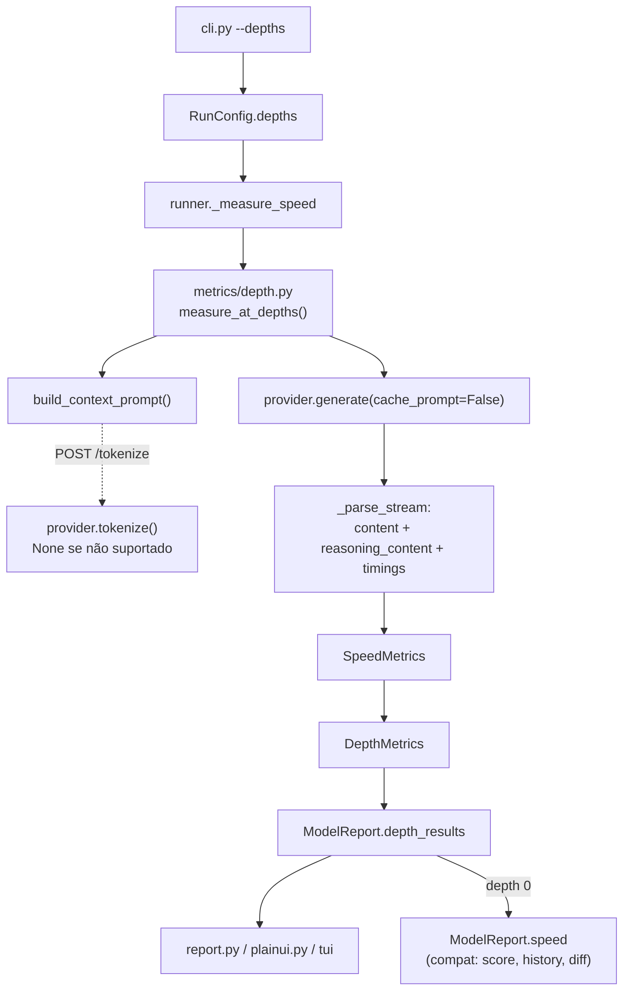

# Métricas de Performance Bruta Design

**Spec**: `.specs/features/perf-metrics/spec.md`
**Status**: Draft

---

## Architecture Overview

Três mudanças independentes empilhadas, da mais interna para a mais externa. Nenhuma cria
um caminho novo de rede: tudo passa pelo `generate()` que já existe.

1. **Parsing do stream** (`openai_compat.py`) passa a ler dois campos que o servidor já manda e
   que hoje são descartados: `delta.reasoning_content` e o objeto `timings` do chunk final.
2. **Forma do resultado** (`models.py`) ganha `DepthMetrics`, um ponto de medição por
   profundidade, espelhando o `ConcurrencyPoint` que `metrics/throughput.py` já usa.
3. **Varredura** (`metrics/depth.py`, novo) sintetiza o prompt na profundidade alvo e roda a
   medição; o `Runner` chama e guarda a lista.



A seta pontilhada é a única opcional: sem `/tokenize` a profundidade é estimada e depois
corrigida pelo `prompt_n` que a própria medição devolve.

---

## Code Reuse Analysis

### Existing Components to Leverage

| Component | Location | How to Use |
| --------- | -------- | ---------- |
| `parse_levels()` | `metrics/throughput.py:28` | Copiar a forma para `parse_depths()` — mesma validação de lista `"0,8192,32768"`, mas aceitando `0` e preservando a ordem dada (PERF-11) |
| `ConcurrencyPoint` | `metrics/throughput.py:47` | Precedente exato de "dataclass por ponto de medição, com `to_dict`" — `DepthMetrics` segue o mesmo molde |
| `SpeedMetrics.prompt_eval_s` | `models.py` | Campo já declarado e **nunca escrito**; passa a receber `timings.prompt_ms / 1000` (PERF-08) |
| `_pick()` em `from_dict` | `models.py` | Já ignora chaves desconhecidas — é o que faz runs antigos carregarem sem alteração (PERF-16) |
| `LlamaRouterClient._get_json` / `_headers` | `lifecycle/router.py:52,62` | Padrão de chamada HTTP autenticada com erro traduzido; o `tokenize()` do provider segue igual |
| `RSSSampler` | `metrics/memory.py` | Inalterado: continua amostrando a run inteira do modelo, agora abrangendo as 3 profundidades |
| `fmt_tps` / `fmt_ttft` | `report.py` | Reutilizados nas colunas novas; `fmt_tps` já trata `0` — precisa de um caminho `None` → `–` (PERF-09) |

### Integration Points

| System | Integration Method |
| ------ | ------------------ |
| Router llama.cpp | `POST /tokenize` (verificado: existe, devolve `{"tokens":[int]}`) e `cache_prompt:false` no corpo do `/v1/chat/completions` (verificado: zera `cache_n`) |
| `score.py` | Sem alteração — continua lendo `ModelReport.speed.tokens_per_sec`, que passa a ser por contrato o decode na menor profundidade (PERF-15) |
| `history.py` / `diff` | Sem alteração — mesma leitura de `speed.tokens_per_sec` (PERF-17) |
| `cache.py` | Sem alteração — só cacheia respostas de qualidade, que não passam pela varredura |

---

## Components

### `parse_depths`

- **Purpose**: transformar `"0,8192,32768"` na lista de profundidades da run.
- **Location**: `src/homebench/metrics/depth.py`
- **Interfaces**:
  - `parse_depths(spec: str) -> List[int]` — erro `ValueError` em valor não inteiro ou negativo; lista vazia devolve `[0]`.
- **Dependencies**: nenhuma.
- **Reuses**: forma de `throughput.parse_levels`. **Diferença deliberada:** não ordena nem deduplica — a spec manda respeitar a ordem dada (PERF-11) e não deduplicar (edge case).

### `build_context_prompt`

- **Purpose**: produzir um prompt cuja contagem de tokens bata com a profundidade alvo.
- **Location**: `src/homebench/metrics/depth.py`
- **Interfaces**:
  - `build_context_prompt(target: int, tokenize: Optional[Callable[[str], int]]) -> Tuple[str, Optional[int]]` — devolve o texto e a contagem exata quando houve tokenizer, `None` quando foi estimativa.
- **Dependencies**: o `tokenize` injetado (não importa provider — mantém o módulo testável sem rede).
- **Reuses**: nada; lógica nova.
- **Algoritmo**: mede a unidade de filler 1× e 100× para derivar inclinação e intercepto (medido ao vivo: 11 e 1001 tokens ⇒ 10 tokens/unidade + 1 de BOS), resolve o número de repetições, confere com uma terceira chamada e apara o excedente. Três chamadas, resultado exato. Sem tokenizer: usa a razão fixa `~0.75 palavra/token` e aceita o desvio, que a medição corrige depois via `prompt_n`.

### `measure_at_depths`

- **Purpose**: rodar a medição de velocidade em cada profundidade e devolver os pontos.
- **Location**: `src/homebench/metrics/depth.py`
- **Interfaces**:
  - `measure_at_depths(provider, model, depths, *, cfg, warn) -> List[DepthMetrics]`
- **Dependencies**: `Provider.generate`, `Provider.tokenize` (opcional), `RunConfig`.
- **Reuses**: a lógica de "repetir `cfg.repeat` vezes e ficar com o melhor" que hoje mora em `runner._measure_speed`, movida para cá e aplicada **dentro** de cada profundidade (edge case do `--repeat`).
- **Contrato de falha**: um `ProviderError` de contexto excedido vira `warn(...)` + profundidade pulada; qualquer outro `ProviderError` sobe e falha o modelo, preservando MLC-11.

### `Provider.tokenize` (capacidade opcional)

- **Purpose**: contar tokens exatamente, quando o backend sabe.
- **Location**: `providers/base.py` (default `None`), `providers/llamacpp.py` (implementa via `POST /tokenize`).
- **Interfaces**:
  - `tokenize(model: str, text: str) -> Optional[int]` — `None` significa "não sei", nunca uma estimativa disfarçada.
- **Reuses**: `_headers()` do `OpenAICompatibleProvider`.

### Parsing do stream

- **Purpose**: contar o que o servidor de fato gerou e usar os timings dele.
- **Location**: `providers/openai_compat.py::generate`
- **Mudanças**:
  - acumula `delta.reasoning_content` num buffer separado de `delta.content`;
  - o marco de TTFT dispara no **primeiro token de qualquer um dos dois** (PERF-02);
  - lê `timings` do chunk final: `prompt_per_second`, `predicted_per_second`, `prompt_ms`, `prompt_n`, `cache_n`;
  - aceita `cache_prompt: bool = True` como parâmetro de `generate`, enviado no corpo.
- **Reuses**: todo o laço de SSE existente; a mudança é dentro do `for choice in ...`.

### Superfícies de saída

- **Purpose**: uma linha por (modelo, profundidade), com prefill e decode separados.
- **Location**: `report.py` (Rich + Markdown + HTML), `plainui.py`, `tui/app.py`
- **Interfaces**:
  - `leaderboard_rows(result) -> List[Row]` — helper único em `report.py` que expande `ModelReport` em linhas; os três renderizadores consomem o mesmo helper para não divergirem (PERF-17 AC4).
- **Reuses**: as tabelas Rich existentes; muda a lista de colunas e a fonte das linhas.

---

## Data Models

### `DepthMetrics`

```python
@dataclass
class DepthMetrics:
    depth_requested: int          # o que foi pedido (0, 8192, 32768)
    depth_actual: int = 0         # prompt_n do servidor — a verdade (PERF-12)
    prefill_tps: Optional[float] = None   # None = desconhecido, nunca 0 (PERF-09)
    decode_tps: float = 0.0
    ttft_s: float = 0.0
    prompt_eval_s: float = 0.0
    output_tokens: int = 0
    cache_hit_tokens: int = 0     # timings.cache_n; >0 contamina o prefill
    skipped: Optional[str] = None # motivo, quando a profundidade não pôde ser medida
```

**Relationships**: `ModelReport.depth_results: List[DepthMetrics]`. `ModelReport.speed`
permanece e passa a ser, por contrato, o ponto da **menor** profundidade medida.

### `SpeedMetrics` (campos adicionados)

```python
    content_tokens: int = 0       # tokens em delta.content
    reasoning_tokens: int = 0     # tokens em delta.reasoning_content (PERF-03)
    prefill_tps: Optional[float] = None
    timings_source: str = "client"   # "server" quando veio de timings
```

Campos novos com default ⇒ `from_dict` de runs antigos segue válido via `_pick`.

---

## Error Handling Strategy

| Error Scenario | Handling | User Impact |
| -------------- | -------- | ----------- |
| Modelo devolve tudo em `reasoning_content` | Conta como token gerado; `text` fica vazio | tok/s real na tabela; qualidade daquele modelo pontua 0, o que é correto |
| Geração sem nenhum token (`content` e `reasoning` vazios) | `ModelReport.warnings` + linha marcada | Usuário vê aviso em vez de `0.00` silencioso (PERF-05) |
| Servidor sem `timings` | Cai para cronometragem no cliente; `prefill_tps = None` | Coluna de prefill mostra `–` (PERF-07/09) |
| Contexto excedido numa profundidade | Pula só aquela profundidade, grava motivo em `skipped` | Linha aparece com `–` e o motivo; as outras profundidades do modelo seguem (PERF-14) |
| `cache_n > 0` numa medição | Aviso de prefill possivelmente contaminado | Número é mostrado com ressalva, não descartado |
| `--depths` inválido | `ValueError` → `SystemExit` na CLI, antes de carregar modelo | Mensagem citando o valor inválido; nenhum modelo é tocado |
| `POST /tokenize` falha ou 404 | `tokenize()` devolve `None`; cai na estimativa | Profundidade real gravada pode divergir do alvo; nada quebra |

---

## Risks & Concerns

| Concern | Location (file:line) | Impact | Mitigation |
| ------- | -------------------- | ------ | ---------- |
| Custo de tempo da varredura por padrão | `runner.py:192` | Run de 3 modelos passa de ~1 min para vários; usuário pode achar que travou | Emitir `EV_PHASE` com a profundidade corrente para a TUI mostrar progresso; `--depths 0` documentado no `USO.md` |
| `_measure_speed` não captura `ProviderError` | `runner.py:218` | Já anotado como dívida em `model-lifecycle/design.md`; agora o laço é maior, então o raio de perda cresce | `measure_at_depths` captura só o erro de contexto excedido e deixa o resto subir — comportamento MLC-11 preservado de propósito |
| `fmt_tps(0)` hoje devolve texto de zero | `report.py` | Um `None` de prefill renderizaria errado | Tratar `None` explicitamente no helper de linha, não dentro do `fmt_tps` (evita mudar o contrato de quem já usa) |
| Três renderizadores duplicam a montagem de linha | `report.py:100`, `plainui.py:77`, `tui/app.py:133` | Colunas divergem entre terminal, Markdown e HTML | Extrair `leaderboard_rows()` e consumir nos três — reduz a duplicação que já existe hoje |
| Ordenação "3 menores modelos" é no-op no llamacpp | `providers/llamacpp.py` (`size_bytes` sempre 0) | Dívida pré-existente: o padrão sem `-m` pega 3 modelos arbitrários, e agora cada um custa 3 profundidades | Fora de escopo; registrado. Mitigação prática: `USO.md` já orienta usar `-m` |
| Estado do router se a run for interrompida | `cli.py::_prepare_router_models` | Um Ctrl-C no meio de uma varredura longa deixa modelo residente | Comportamento atual, inalterado por esta feature; a confirmação de AD-002 já cobre |

---

## Tech Decisions

| Decision | Choice | Rationale |
| -------- | ------ | --------- |
| Onde mora o laço de profundidade | Módulo novo `metrics/depth.py`, chamado pelo `Runner` | Segue a convenção de `metrics/` (memory, throughput); mantém o `Runner` fino e o laço testável sem rede. Alternativas descartadas: no `Runner` (incha o orquestrador, difícil testar isolado) e no provider (cada backend reimplementaria) |
| Compatibilidade do resultado | `speed` continua sendo a profundidade 0; varredura em campo novo | Zero mudança em `score.py`, `history.py` e `diff`; runs antigos carregam via `_pick`. Alternativa descartada: trocar `speed` por uma lista, que quebraria os três |
| Origem dos timings | Servidor quando presente, cliente como fallback, com `timings_source` gravado | O número precisa ser auditável depois; sem o campo, dois runs incomparáveis pareceriam iguais |
| Prefill indisponível | `Optional[float] = None` | `0.0` é um valor de medição válido e mentiroso aqui; `None` força a renderização a mostrar `–` |
| Profundidade exata | `POST /tokenize` quando existe, estimativa quando não | Verificado ao vivo. Contar palavras erra ~13%, o que invalidaria a comparação entre modelos com tokenizers diferentes |
| `cache_prompt` | `False` em toda medição | Sem isso o prefill da 2ª medição lê KV reusado: 2 540 vs 1 478 tok/s no mesmo prompt |

> Nenhuma decisão aqui muda convenção de projeto — todas são locais à feature. `AD-001`
> (ciclo de vida só por HTTP) e `AD-005` (`lifecycle/` headless) seguem respeitados: o módulo
> novo fica em `metrics/`, não importa `lifecycle/`, e nada toca em processo ou container.
